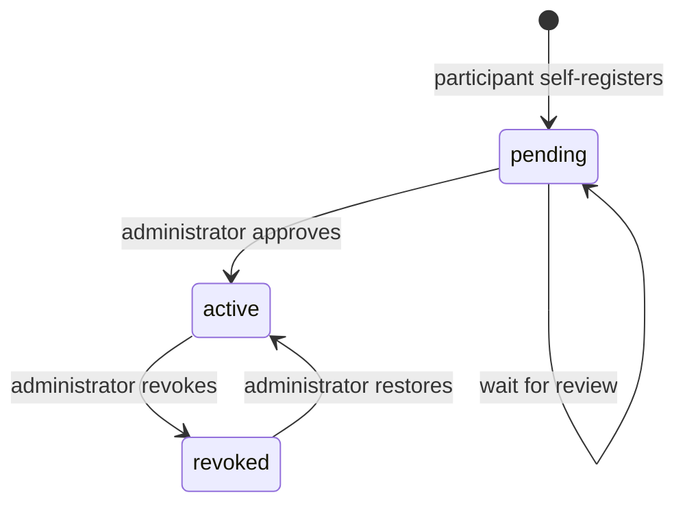
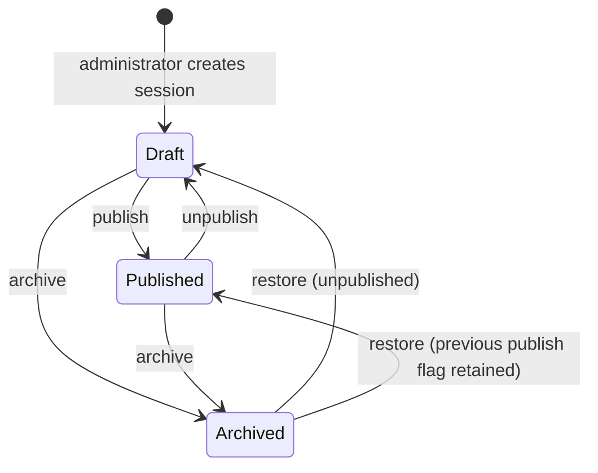
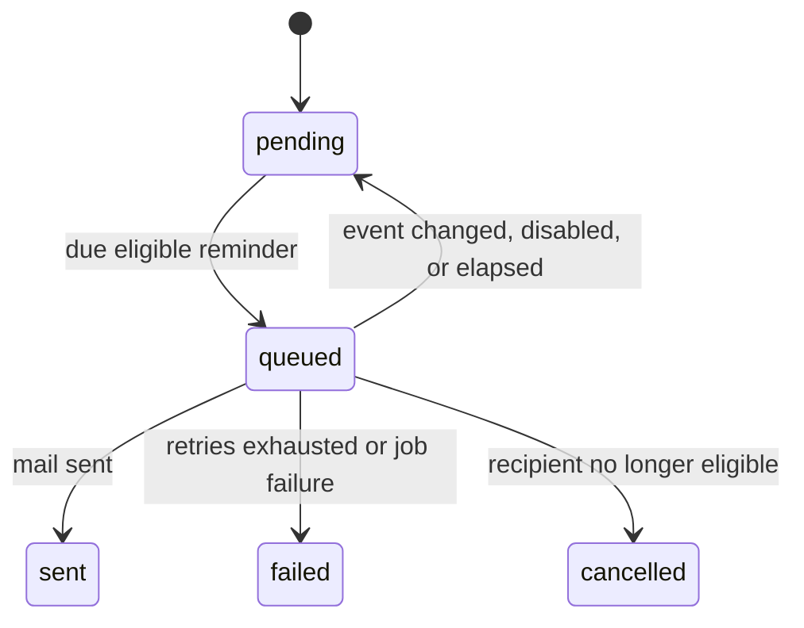

# Lead Lab state machines
**AI-generated by:** Alson (A.I Agent)

Lead Lab has three operational lifecycles: access, Learning Sessions, and reminder deliveries. `CONCEPTS.md:5-10`, `CONCEPTS.md:44-46`, `application/source/app/Models/CalendarEventReminderDelivery.php:39-47`

## Access Status

`pending`, `active`, and `revoked` are the defined Access Status values. An active user must also have `is_active = true` to access Lead Lab. `application/source/app/Models/User.php:41-45`, `application/source/app/Models/User.php:95-98`

| State | Normal outcome | Recovery or denial |
|---|---|---|
| Pending | The user sees the pending-registration page. | Administrator approval moves the account to active. `application/source/app/Http/Middleware/EnsureActiveUser.php:14-16`, `application/source/app/Http/Controllers/AdminMemberController.php:50-65` |
| Active | The user can use authenticated portal routes. | Revocation changes the status and disables access. `application/source/routes/web.php:24-56`, `application/source/app/Http/Controllers/AdminMemberController.php:62-79` |
| Revoked | The user is logged out and redirected to sign-in with an inactive-access error. | Administrator restoration moves the account to active. `application/source/app/Http/Middleware/EnsureActiveUser.php:18-25`, `application/source/app/Http/Controllers/AdminMemberController.php:67-79` |

## Learning Session lifecycle

A Learning Session uses `is_published` and `archived_at`, rather than a single stored state. Participants can see only published, non-archived sessions. `application/source/app/Models/LearningSession.php:23-35`, `application/source/app/Http/Controllers/LearningSessionController.php:28-32` The controller creates drafts, publishes or unpublishes them, archives them, and clears the archive timestamp on restoration. `application/source/app/Http/Controllers/AdminLearningSessionController.php:98-105`, `application/source/app/Http/Controllers/AdminLearningSessionController.php:154-195`

## Calendar Event reminder delivery

| State | Meaning | Transition source |
|---|---|---|
| Pending | Delivery exists but is not queued. | Event changes or invalid scheduled state reset queued work. `application/source/app/Jobs/SendCalendarEventReminder.php:39-49` |
| Queued | The scheduler selected the delivery and dispatched a job. | Queue service writes status and timestamp before dispatch. `application/source/app/Services/CalendarEventReminderService.php:67-98` |
| Sent | The mail notification was sent. | Job records `sent_at`. `application/source/app/Jobs/SendCalendarEventReminder.php:70-79` |
| Failed | The job failed after Laravel processing. | Job failure handler records the error. `application/source/app/Jobs/SendCalendarEventReminder.php:82-90` |
| Cancelled | The recipient is no longer active, verified, or eligible. | Job cancels delivery. `application/source/app/Jobs/SendCalendarEventReminder.php:52-62` |
