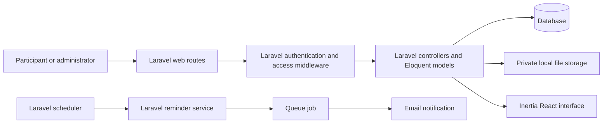

# Lead Lab system overview
**AI-generated by:** Alson (A.I Agent)

Lead Lab is a Laravel 13 modular monolith with an Inertia React and TypeScript interface. Laravel owns routing, middleware, controllers, Eloquent data access, queues, and scheduled work; React renders the browser interface through Inertia. `application/source/composer.json:10-17`, `application/source/bootstrap/app.php:12-37`, `application/source/package.json:29-31`, `application/source/routes/console.php:7-9`

It is a private, self-hosted learning portal for approved participants. It provides recorded Learning Sessions, protected Learning Resources, Session Q&A, and Calendar Events; administrators manage access and published content. `artifacts/lead-lab-web-app-scope-and-requirements.md:10-14`, `application/source/routes/web.php:24-56`

| Layer | Responsibility | Anchor |
|---|---|---|
| Laravel application core | Provides the web application runtime, route configuration, middleware aliases, controllers, Eloquent models, queue jobs, and scheduled commands. | `application/source/composer.json:10-17`, `application/source/bootstrap/app.php:12-37`, `application/source/routes/console.php:7-9` |
| Web boundary | Defines protected participant and administrator routes. | `application/source/routes/web.php:24-56` |
| Access control | Blocks pending and inactive accounts; restricts administrator routes. | `application/source/app/Http/Middleware/EnsureActiveUser.php:12-29`, `application/source/app/Http/Middleware/EnsureAdmin.php:11-16` |
| Application features | Serves sessions, resources, Q&A, calendar, members, and administration actions. | `application/source/routes/web.php:27-55` |
| Data and files | Stores relational records and stores resources outside the public route surface. | `application/source/database/migrations/2026_08_19_120002_create_learning_resources_table.php:11-19`, `application/source/app/Http/Controllers/LearningResourceController.php:12-27` |
| Interface | Renders server data through Inertia and React. | `application/source/composer.json:10-17`, `application/source/package.json:29-31` |
| Timed delivery | Schedules due reminders every minute and sends them through queued work. | `application/source/routes/console.php:7-9`, `application/source/app/Services/CalendarEventReminderService.php:15-46` |

## Primary flow: approved participant views a session

1. A signed-in request reaches a route in the `auth` and `active` group. `application/source/routes/web.php:24-37`
2. Pending users are sent to the pending-registration page; inactive or revoked users are signed out. `application/source/app/Http/Middleware/EnsureActiveUser.php:14-25`
3. The session controller exposes a session only when it is published and not archived, unless the viewer is an administrator. `application/source/app/Http/Controllers/LearningSessionController.php:69-77`
4. The same visibility rule controls downloads of the session's Learning Resources. `application/source/app/Http/Controllers/LearningResourceController.php:12-27`

## Core invariants

| Invariant | Enforcement |
|---|---|
| Only active accounts with `access_status = active` can enter Lead Lab. | `application/source/app/Models/User.php:95-98`, `application/source/app/Http/Middleware/EnsureActiveUser.php:12-29` |
| Only administrators can use `/admin` routes. | `application/source/routes/web.php:41-56`, `application/source/app/Http/Middleware/EnsureAdmin.php:11-16` |
| Participants only see published, non-archived Learning Sessions and their resources. | `application/source/app/Http/Controllers/LearningSessionController.php:28-32`, `application/source/app/Http/Controllers/LearningResourceController.php:16-21` |
| Each user can vote once per question or answer. | `application/source/database/migrations/2026_08_24_120000_create_session_q_and_a_tables.php:28-42` |
| A reminder delivery is unique per event, recipient, and reminder offset. | `application/source/database/migrations/2026_08_26_130001_create_calendar_event_reminder_deliveries_table.php:24-28` |

See [access, content, and reminder mechanisms](mechanisms.md), [data and security](data-and-security.md), and the [state machine](state-machine.md).
